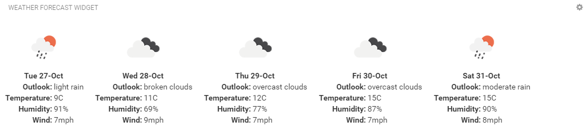

# Cumulocity IoT Weather forecast widget

## Features
**Realtime:** Realtime weather updates from the OpenWeatherAPI

**Configurable Refresh rate:** Control how often the weather updates

## Installation

### Runtime Widget Deployment?

* This widget supports runtime deployment. Download the [Runtime Binary](https://github.com/SoftwareAG/cumulocity-weather-forecast-widget/releases/download/1.0.1/weather-forecast-widget_v1.0.1.zip) and use Application Builder to install your runtime widget.

## Quickstart
This guide will teach you how to add the widget in your existing or new dashboard.

1. Register a new account with [OpenWeather](https://openweathermap.org/)
2. Verify your openweathermap account by clicking on the email which has been sent to you
3. Log into your openweathermap account and add a new API under `API keys`
3. Open the Application Builder application from the app switcher (Next to your username in the top right)
4. Add a new dashboard or navigate to an existing dashboard
5. Click `Add Widget`
6. Search for `Weather Forecast`
7. See below for the configuration options

### Configuration options

1. Select your device in the `Target Assets or Devices` field
2. Enter the `API Key` which was generated in your openweathermap `API keys` page
3. Enter the `Refresh (in hours)` e.g. 1 
4. Enter the `City`. This is an optional field. The latitude and longitude of your selected device will be used if it has been configured.

   **Note** the City will default to London, if no city name is typed into this field and the selected device doesn't contain location (latitude & longitude) details. 

### Development - to enhance and test this widget in your local environment
1. Clone the repository on your local machine using `git clone https://github.com/SoftwareAG/cumulocity-weather-forecast-widget.git`.
2. Run `npm install` to download the module dependencies.
3. Run `c8ycli server -u https://your_tenant_url` to start the server.
4. Go to `http://localhost:9000/apps/cockpit/` in the browser to view and test your changes.
5. (Optional) push the changes back to this repository.

### Build - to create a new build of the weather-forecast widget for the Runtime Widget Loader
1. Finish the development and testing on your local machine.
2. Run `gulp` to start the build process.
3. Use the `weather-forecast-widget.zip` file in the `dist` folder as your distribution file.

------------------------------

This widget is provided as-is and without warranty or support. They do not constitute part of the Software AG product suite. Users are free to use, fork and modify them, subject to the license agreement. While Software AG welcomes contributions, we cannot guarantee to include every contribution in the master project.
_____________________
For more information you can Ask a Question in the [TECHcommunity Forums](https://tech.forums.softwareag.com/tags/c/forum/1/Cumulocity-IoT).

You can find additional information in the [Software AG TECHcommunity](https://tech.forums.softwareag.com/tag/Cumulocity-IoT).

